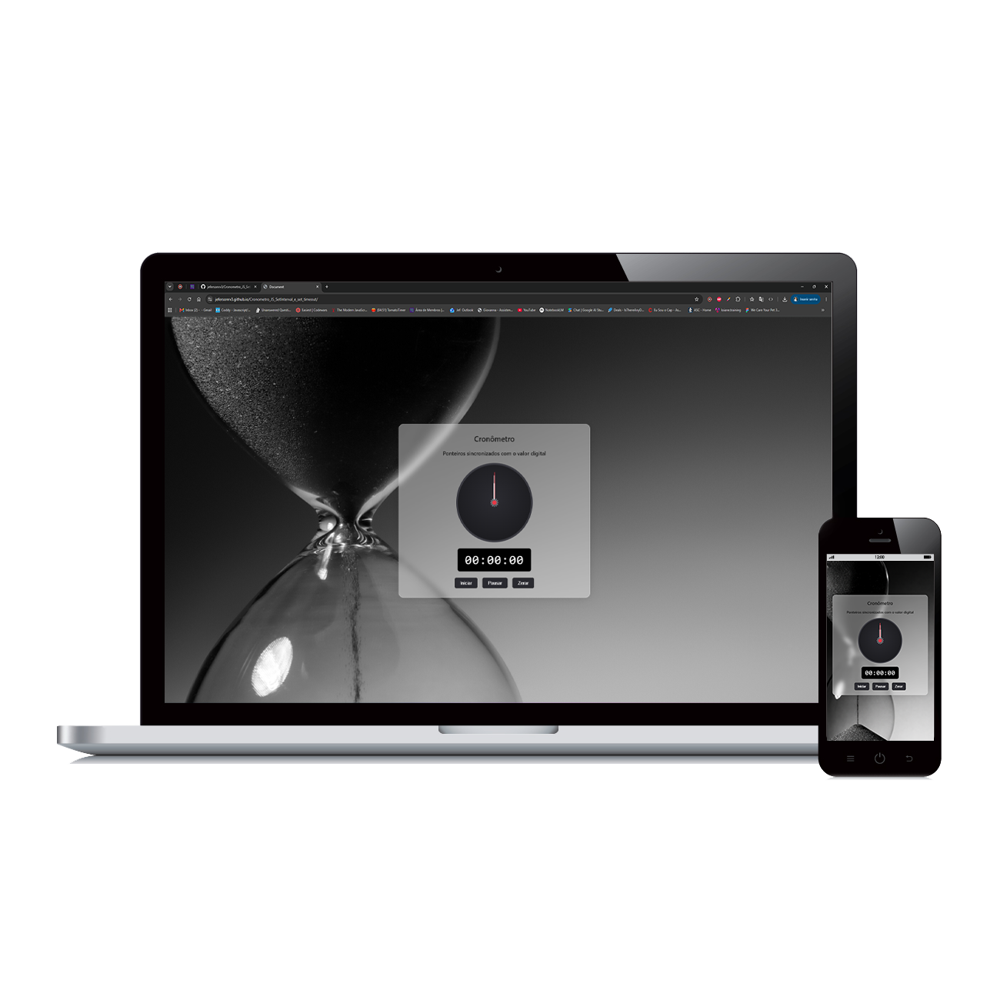

<h1> Projeto cronômetro com Javascript </h1>

<h2> Nesse projeto de estudos colocamos em prática as funcionalidades do CSS3  e HTML , bem como utilizamos como foco o SetInterval e SetTimeout utilizando Javascript  </h2>

 O projeto Tem como objetivo servir de exemplo prático para a implementação dessas ferramentas.
 

 Estilizei de acordo com gosto pessoal para uma aparência agradável e também para experimentar um pouco e praticar o CSS

 Como é possível visualizar nas imagens abaixo o projeto tem compatibilidade completa com diversos tipos de tela, algo que eu também quis praticar e testar. 

